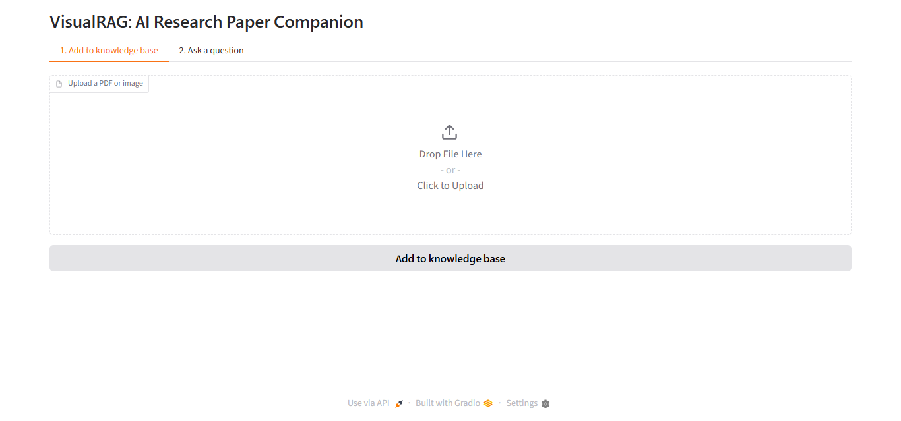
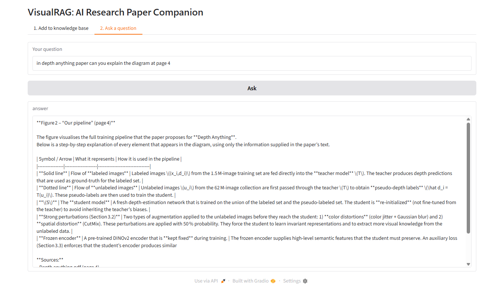
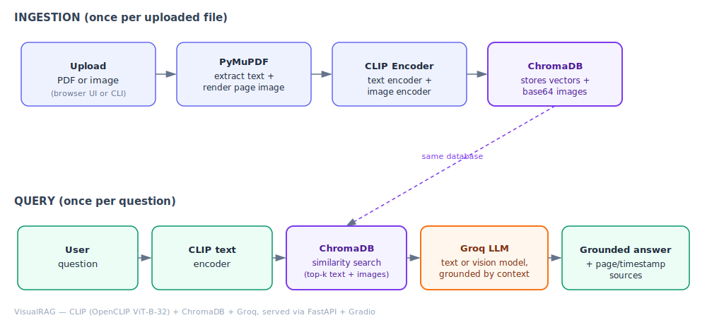

# VisualRAG — Research Paper Companion

A multimodal RAG (Retrieval-Augmented Generation) system that answers questions across PDFs and diagram images — including content that lives inside figures, tables, and equations, not just plain extracted text.

Built with LangChain, ChromaDB, OpenCLIP, Groq, FastAPI, Gradio, and Docker.

---

## Demo

<!-- Replace with real screenshots after your first run — see filenames below -->



Save into `assets/screenshots/`:
- `upload.png` — the upload tab right after a successful file add
- `ask.png` — the ask tab with a real question and grounded answer showing
- *(optional)* a short screen-recording GIF of upload → ask → answer, for a stronger portfolio link

---

## Architecture



Two pipelines share one vector database:
- **Ingestion** turns every PDF page into a text chunk and a page image, embeds both with CLIP, and stores them in ChromaDB.
- **Query** embeds the user's question with the same CLIP model, retrieves the closest matches from ChromaDB, and hands them to Groq's LLM to write a grounded answer.

---

## How It Works

1. **Ingest** — a PDF page becomes (a) a text chunk and (b) a rendered page image. CLIP embeds both into the same vector space, and ChromaDB stores them. Add files through the browser UI (one at a time) or in bulk with `python ingest.py`.
2. **Ask** — the question is embedded the same way; ChromaDB returns the closest matching text and/or images; Groq's LLM writes an answer grounded in exactly that retrieved material, with sources cited. If any retrieved match is an image, a vision-capable model is used automatically instead of a text-only one.
3. **Interface** — a Gradio UI (upload tab + ask tab) is mounted directly inside the FastAPI app, so one command starts everything. The underlying `/ask` and `/ingest` endpoints are also independently testable at `/docs`.
4. **Privacy** — files uploaded through the app are processed and then deleted. Only their embeddings (and, for images, a base64 copy) remain in `chroma_db/`. Files you place yourself in `data/pdfs/` or `data/images/` for bulk `ingest.py` runs are left untouched, since you put them there intentionally.

---

## Tech Stack

| Layer | Tool |
|---|---|
| Embeddings | OpenCLIP (`ViT-B-32`) via LangChain |
| Vector database | ChromaDB |
| Generation | Groq API (text + vision models) |
| Backend | FastAPI |
| Frontend | Gradio |
| PDF processing | PyMuPDF |
| Containerization | Docker |

---

## Installation

Requires Python 3.10+. No GPU needed.

```bash
python -m venv venv
venv\Scripts\activate      # Windows
source venv/bin/activate   # Mac/Linux

pip install -r requirements.txt
```

Get a free Groq API key (no credit card) at https://console.groq.com/keys, then copy `.env.example` to `.env` and paste it in.

---

## Usage

```bash
uvicorn api:app --reload
```

Open **http://127.0.0.1:8000/ui** — upload PDFs/images on the first tab, ask questions on the second.

Other ways to interact with it:
- `python ingest.py` — bulk-process every file already sitting in `data/pdfs/` and `data/images/`, instead of uploading one at a time.
- `http://127.0.0.1:8000/docs` — the raw API, testable directly from the browser (or curl/Postman), independent of the UI.

---

## Project Structure

```
VisualRAG/
├── rag_core.py         # embeddings, vector store, search, Groq generation
├── ingest.py            # bulk-add PDFs/images from data/ folders; also used by api.py and app_ui.py
├── api.py               # FastAPI backend (/ask, /ingest) + mounts the Gradio UI at /ui
├── app_ui.py             # Gradio interface: upload tab + ask tab
├── requirements.txt
├── .env.example
├── Dockerfile             # containerizes the API
├── data/
│   ├── pdfs/                # your own PDF library for bulk ingest.py runs
│   ├── images/                # your own diagrams for bulk ingest.py runs
│   └── rendered_pages/         # scratch space, auto-cleaned after each page is embedded
└── chroma_db/                  # the persistent vector database (git-ignored)
```

---

## Future Scope

- YouTube video ingestion (transcript + slide-change keyframes), scoped out of v1 to ship faster
- Smarter text chunking (`RecursiveCharacterTextSplitter`) instead of one chunk per page
- OCR fallback for scanned/image-only PDFs
- Multi-user support with per-user collections instead of a single shared database

---

## Limitations

- Text extraction relies on the PDF's built-in text layer — scanned/image-only PDFs return the page-image side only, no text side.
- Each PDF page is treated as a single chunk; very dense pages could exceed what's useful in one retrieval unit.
- Groq's available model names change fairly often — if generation fails with a "model not found" error, update `GROQ_TEXT_MODEL` / `GROQ_VISION_MODEL` in `.env` (see https://console.groq.com/docs/models).
- Runs as a single local instance; not built for concurrent multi-user production load.

---

## License

MIT
